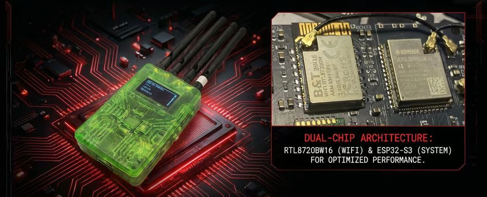

  

<h1 align="center">⚡ Thor Chimera ⚡</h1>

  <b>The Ultimate Multi-Protocol Pentesting & RF Research Platform</b>

  <a href="#features">Features</a> •
  <a href="#hardware">Hardware</a> •
  <a href="#quick-start">Quick Start</a> •
  <a href="#installation">Installation</a> •
  <a href="#usage">Usage</a> •
  <a href="#file-compatibility">Compatibility</a> •
  <a href="#contributing">Contributing</a> •
  <a href="#license">License</a>

  
  
  
  

  

---

## 🎯 Overview

**Thor Chimera** is an all-in-one wireless security research and penetration testing platform designed for RF enthusiasts, security researchers, and red team professionals. It combines multiple radio protocols, hardware interfaces, and analysis tools into a single, portable, and powerful device.

> 🔓 **Educational & Authorized Testing Purposes Only** — Always ensure you have explicit permission before testing any system.

---

## ✨ Features

### 📡 Infrared (IR)
- **Decode** IR signals from any remote control
- **Receive & capture** IR transmissions
- **Save raw** IR captures to SD card
- **Transmit** replay attacks with saved signals

### 📻 Sub-GHz RF
- **Spectrum analyzer** for sub-1GHz frequencies
- **Decode** common RF protocols
- **Receive & capture** RF signals
- **Save raw** RF captures
- **Transmit** replay attacks
- **Rolling code automotive decoder** — analyze and decode modern vehicle key fobs

### 🎮 nRF24
- **Protocol analyzer** for nRF24L01+ 2.4GHz transceivers
- Sniff and analyze nRF24 communications

### 📶 Wi-Fi (Dual Band)
- **2.4 GHz & 5 GHz** full support
- **Web-based configuration interface** — easy setup via browser
- **File upload & creation** directly from web UI
- **Network analyzer** — scan, monitor, and analyze Wi-Fi networks
- **All existing Wi-Fi sniffers** integrated (probe requests, beacon frames, deauth detection, WPA handshakes, etc.)

### 🔵 Bluetooth Low Energy (BLE)
- **Bluetooth scanning** — discover nearby devices
- **AirTag detection & identification** — locate Apple tracking devices
- **Ray-Ban Meta detection** — identify smart glasses
- **Skimmer detection** — find malicious card skimmers
- **Flipper Zero identification** — detect nearby Flipper devices
- **Script execution via BLE** — automate tasks over Bluetooth

### 🔌 USB
- **Script execution via USB** — run payloads through USB interface
- Full **DuckyScript** compatibility

### 🏷️ NFC
- **Read & copy** NFC tags
- **Emulate** NFC cards
- **Write** to rewritable and compatible tags only

### 🦎 Chameleon Ultra Integration
- **Full API control** of Chameleon Ultra device
- **Copy** cards via Chameleon
- **Emulate** cards using files stored on SD

### 💾 SD Card Support
- **Save** all captured files (RF, IR, NFC, scripts)
- **Load & use** saved files for replay and analysis

### 🖨️ OctoPrint Controller
- **Remote 3D printer management** via OctoPrint integration

### 🔧 Hardware Tools
- **I2C Scanner** — detect and interact with I2C devices
- **Serial Monitor** — debug and communicate with serial devices
- **Geiger Counter Module** compatible — radiation monitoring support

---

## 🔗 File Compatibility

Thor Chimera is designed to work seamlessly with existing pentesting ecosystems:

| Source | File Type | Support |
|--------|-----------|---------|
| **Flipper Zero** | `.sub`, `.ir`, DuckyScript(.txt) | ✅ Full |
| **Bruce Firmware** | `.sub`, `.ir`, DuckyScript(.txt) | ✅ Full |
| **Custom** | Raw | ✅ Full |

> 🔄 **Import & Export** — Use your existing Flipper Zero and Bruce collections directly on Thor Chimera without conversion.

---

## 🛠️ Hardware 

| Component | Specification |
|-----------|---------------|
| **Primary MCU** | RTL8720DN B&T |
| **Secondary MCU** | ESP32-S3 (Dual-core, Wi-Fi + BLE) |
| **IR** | 38kHz IR transmitter + receiver |
| **Sub-GHz** | CC1101 transceiver module |
| **nRF24** | nRF24L01+ 2.4GHz module |
| **Wi-Fi** | Built-in 2.4GHz + 5GHz support |
| **NFC** | PN532 |
| **SD Card** | MicroSD slot (up to 32GB recommended) |
| **Display** | Oled 128x64 |
| **Chameleon** | Chameleon Ultra via BLE |
| **USB** | USB HID support |
| **I2C/Serial** | GPIO breakout headers |
| **Geiger** | Compatible Geiger counter module gpio 47/GND |

---

## 🚀 Quick Start

### Prerequisites
- Thor Chimera hardware 
- MicroSD card (FAT32 formatted)
- USB-C cable for power/data

### Flashing Firmware
Auto flasher Work in progress
